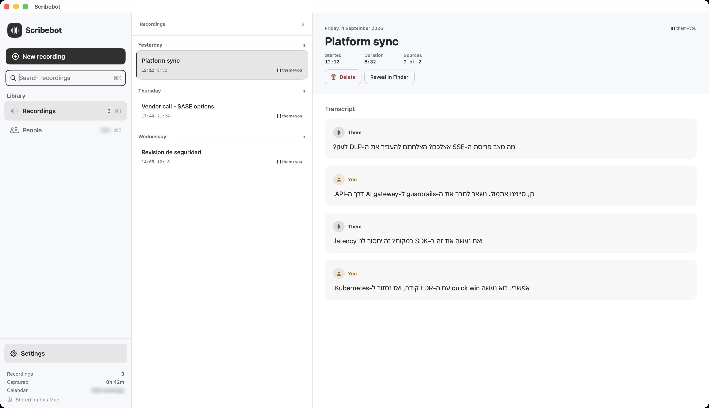
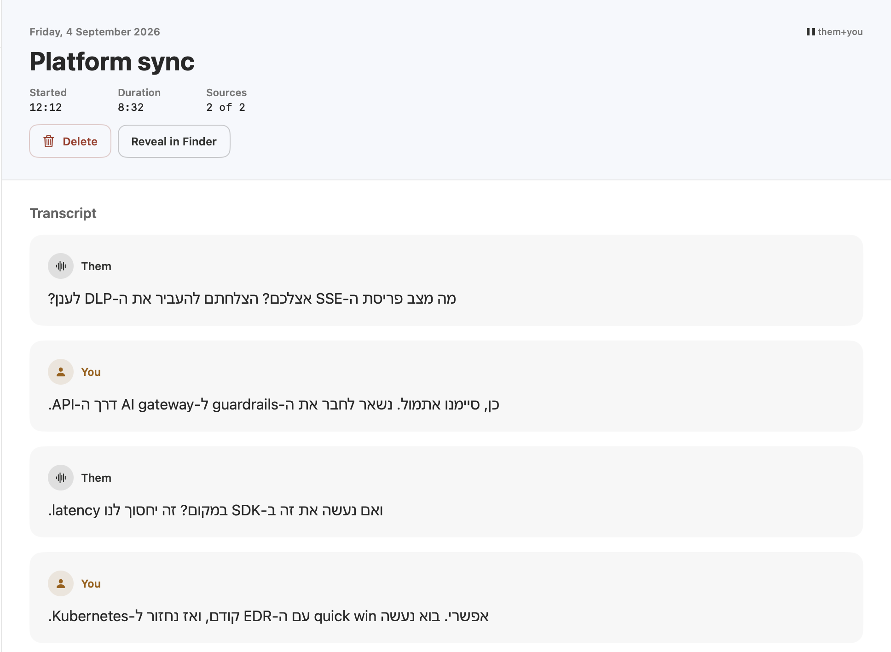

<div align="center">

# 🎙️ Scribebot

### Meeting transcription for Mac that never joins your call.

Records any meeting, in any language, entirely on your own machine.
No bot in the participant list. No audio leaving your Mac.

[](https://www.apple.com/macos/)
[](https://support.apple.com/en-us/HT211814)
[](https://www.python.org/)
[](https://developer.apple.com/swift/)
[](LICENSE)
[](#-privacy)
[](#every-language-your-team-actually-speaks)

</div>



---

## What it is

Scribebot sits in your menu bar and records the meetings you are already in —
Zoom, Teams, Meet, WhatsApp, a browser tab, anything that makes sound. When the
call ends you have the audio, a transcript that knows who said what, and a
summary. All of it produced on your own Mac.

It is a complete meeting record, not a transcription toy:

- 🎧 **Captures any app's audio** through CoreAudio process taps. No virtual
  audio driver to install, and no participant to admit.
- 🌍 **~100 languages**, detected automatically. See below.
- 👥 **Knows who spoke** — exactly, for two-party calls, without guessing.
- 📝 **Summaries, search and export** (Markdown, SRT, plain text).
- ⚡ **~0.5 s decode per chunk**, with a live preview while people talk.
- 🔒 **No network calls at runtime.** At all.

## Every language your team actually speaks

Language is detected per recording — you do not have to tell it anything. The
decoder is Whisper `large-v3-turbo`, so the list is the familiar one: English,
Spanish, French, German, Portuguese, Italian, Dutch, Russian, Arabic, Hebrew,
Hindi, Chinese, Japanese, Korean, Turkish, Polish, Ukrainian and around eighty
more.

```sh
./scribebot.py file meeting.wav              # detect the language
./scribebot.py file meeting.wav --lang es    # or name it
export SCRIBEBOT_LANG=de                     # or set a default
```

Hebrew additionally gets a **dedicated fine-tune** ([ivrit-ai][ivrit]), because
that is the language this project was built and measured against. When
detection comes back Hebrew, the batch pass automatically re-runs on the
specialised model; every other language keeps the general one. You get the
better decoder without choosing it.

[ivrit]: https://huggingface.co/ivrit-ai

### The hard case: meetings that code-switch

The reason this project exists is the meeting that is *mostly* one language and
carries technical vocabulary in another — which is most engineering meetings
outside the English-speaking world. Speech models transliterate exactly the
words that carry the meaning:

```text
Actually said         מה מצב פריסת ה SSE אצלך
Generic model         מה מצב פריסת ה אס אס אי אצלך     ← the term is gone
Scribebot             מה מצב פריסת ה SSE אצלך         ← restored
```

Lose `SSE`, `DLP`, `Kubernetes`, `latency`, and a technical transcript becomes
unsearchable. A glossary of **1,243 terms** restores them after decoding. It
ships tuned for Hebrew ↔ English, and the mechanism is not Hebrew-specific:
any language pairing that borrows English technical vocabulary works the same
way, and adding your own is [the easiest contribution here](#-contributing).

## What makes it different

|  | Scribebot | Meeting bots | Most Mac recorders |
|---|:---:|:---:|:---:|
| Joins your call as a participant | **Never** | Yes | No |
| Audio leaves your machine | **Never** | Yes | Often |
| Needs a virtual audio driver | **No** | — | Usually |
| Knows who said what | **Exactly** | Varies | Guessed |
| Borrowed technical terms | **Restored** | Mangled | Mangled |

**Speaker attribution without diarization.** Scribebot captures the call and
your microphone to two separate files and transcribes them apart. Who spoke is
then a fact about which file the words came from, not something a clustering
algorithm has to guess. For two-party calls it is exact and free.

<div align="center">



</div>

## Download for Mac

Get the **[Scribebot 0.1 DMG](https://github.com/goblin195/ScribeBot/releases/tag/v0.1)**
for Apple Silicon and macOS 14.2+. Drag it into Applications. Python,
whisper.cpp and the model are included. The release is ad-hoc signed, not
Apple-notarized; see the release notes for first-launch instructions. Optional
summaries need a local [Ollama](https://ollama.com) install.

## Build from source

```sh
brew install whisper-cpp                # the decoder
git clone https://github.com/goblin195/ScribeBot.git && cd ScribeBot

# models/ -> place one or both (~1.6 GB each, gitignored)
#   vanilla-large-v3-turbo.bin   general, ~100 languages
#   ivrit-large-v3-turbo.bin     Hebrew fine-tune

./capture/build.sh                      # audio capture helper
./app/build.sh                          # menu bar app -> app/Scribebot.app
open app/Scribebot.app
```

Either model is enough to run; if one is missing the other is used.

On first launch macOS asks for two **separate** permissions:

| Permission | Why | If denied |
|---|---|---|
| **Screen & System Audio Recording** | to hear the call | capture hangs forever, silently |
| **Microphone** | to hear you | your side records as silence |

> The system-audio permission is `kTCCServiceAudioCapture` and is *not* the
> microphone permission. Granting the microphone does nothing for it. This
> catches everyone once.

### Command line

```sh
./scribebot.py record 60             # capture 60s of system audio, transcribe
./scribebot.py record 60 --pid 42    # capture a single application
./scribebot.py file meeting.wav      # transcribe an existing file
./scribebot.py file a.wav --lang fr  # force a language instead of detecting
./scribebot.py rebuild               # repair any transcript saved incomplete
```

`rebuild` rewrites `.txt` files only — it never touches audio.

## How it works

```
  meeting app (Zoom/Teams/Meet)          your voice
          │ CoreAudio process tap             │ AVAudioEngine
          ▼                                   ▼
   <id>.wav  (them)                    <id>-you.wav  (you)
          │                                   │
          └─────────────┬─────────────────────┘
                        ▼
              whisper.cpp on Metal
        language detected → model selected
                        │
              glossary — restore borrowed terms
                        ▼
                    <id>.txt
```

Full detail in [docs/ARCHITECTURE.md](docs/ARCHITECTURE.md).

## Benchmarks

Measured against Tape 0.9.3 on the same Hebrew-with-English audio:

| Metric | Scribebot | Tape 0.9.3 |
|---|:---:|:---:|
| Technical terms preserved | **70.2%** | 46.8% |
| Word error rate | **16.5%** | 21.2% |
| Decode time per chunk | **0.51 s** | 1.62 s |
| Diarization error rate ⚠️ | **15.4%** | 41.0% |

**Read this before quoting those numbers.** The two decoders tie at 46.8% term
preservation — running *Tape's own transcripts* through Scribebot's glossary
scores marginally better than Scribebot's own output. The advantage is a
post-processing stage Tape does not ship, **not** better recognition. And
⚠️ every diarization figure comes from synthetic text-to-speech; no real
multi-speaker recording has ever been scored. Only Hebrew has been benchmarked
at all — the other languages are Whisper's, unmeasured here.

[docs/BENCHMARKS.md](docs/BENCHMARKS.md) keeps the full caveats, including two
claims this project got wrong and retracted.

## 🤝 Contributing

Contributions are genuinely welcome, and one of them is unusually easy to make.

### ⭐ Start here: teach it a term

The glossary is where accuracy actually lives, and it needs no Swift, no audio
knowledge and no model. If you have watched a transcript turn `Kubernetes` into
`קוברנטיס` — or into whatever your language does to it — you can fix it in
`bench/aliases.json`:

```json
{
  "Kubernetes": ["קוברנטיס", "קוברנטס"],
  "Postgres":   ["פוסטגרס"]
}
```

Then:

```sh
./check     # the negative control rejects an alias that damages real text
```

Open a PR with the term and one real sentence it appeared in. **This is the
highest-value contribution to the project**, it scales to any domain —
security, medicine, finance, law — and to any language that borrows English
technical vocabulary.

### Other good places to start

| Area | What's needed | Difficulty |
|---|---|:---:|
| Glossary terms | Transliterations of borrowed technical terms, any language | 🟢 easy |
| Surface the mic warning | The Bluetooth-headset warning reaches `<id>.capture.log` but is still not shown in the UI | 🟢 easy |
| Benchmark another language | Only Hebrew has ever been scored | 🟡 medium |
| Real diarization data | One labelled multi-speaker recording; the benchmark is synthetic | 🟡 medium |
| Latency measurement | True end-to-end lag behind live speech is unmeasured | 🟡 medium |
| Find why the tap stalls | A real call captured 26.9s of 72.5s; the gap is padded and logged, but not prevented | 🔴 involved |

[docs/HANDOVER.md](docs/HANDOVER.md) is an honest account of what works, what is
unproven, and what to do next. Read it before picking something up.

### House rules

1. **Run `./check` before opening a PR.** It is a few seconds and it has caught
   real regressions.
2. **A benchmark gain that fails the negative control is a regression.** Fuzzy
   term matching was tried; it improved the score and corrupted 15.4% of real
   strings. `bench/negative_control.py` holds 45 sentences that must survive
   untouched.
3. **Never swallow a subprocess exit status.** Every silent-failure bug in this
   project's history came from that.
4. **Comments explain *why*,** usually by naming the bug that motivated the line.

See [CONTRIBUTING.md](CONTRIBUTING.md) for the full workflow.

## Project layout

```
scribebot.py          transcribe / record / rebuild
languages.py          language detection and model selection
stream.py, live.py    live preview (LocalAgreement-2)
toolpaths.py          absolute binary resolution
capture/tap.swift     CoreAudio process taps + microphone
app/Sources/          SwiftUI menu-bar app
bench/                scoring, glossary, regression guards
docs/                 architecture, handover, benchmarks, troubleshooting
```

## 🔒 Privacy

Audio, transcripts and summaries are written to
`~/Library/Application Support/Scribebot/` and stay there. **Nothing in this
project makes a network request at runtime.** There is no telemetry, no
account, and no cloud component to opt out of.

Recording a conversation may require the consent of the other participants
where you live. That is your responsibility, not the software's.

## Documentation

| Document | What it covers |
|---|---|
| [ARCHITECTURE](docs/ARCHITECTURE.md) | How capture, transcription and the app fit together |
| [HANDOVER](docs/HANDOVER.md) | Current state, what is unproven, what to do next |
| [BENCHMARKS](docs/BENCHMARKS.md) | Results, and how much to trust each number |
| [TROUBLESHOOTING](docs/TROUBLESHOOTING.md) | Symptoms and their real causes |
| [CONTRIBUTING](CONTRIBUTING.md) | How to contribute |
| [CLAUDE.md](CLAUDE.md) | Working rules for AI agents in this repo |

## Acknowledgements

- [ivrit-ai](https://huggingface.co/ivrit-ai) — the Hebrew fine-tune
- [whisper.cpp](https://github.com/ggerganov/whisper.cpp) — on-device inference
- Macháček, Dabre & Bojar, *Turning Whisper into Real-Time Transcription System*
  (2023) — the confirmed/unconfirmed streaming discipline

## License

[MIT](LICENSE).
